https://homel.vsb.cz/~dor028/Teorie_grafu.pdf

## Definice grafu

- **Graf G** je uspořádaná dvojice `G = (V, E)`, kde V je **neprázdná množina vrcholů** a E je **množina hran** - množina (některých) dvouprvkových podmnožin množiny
- Prvky množiny V nazýváme **vrcholy**
- Prvky množiny E nazýváme **hrany**

## Orientované grafy a multigrafy

- Orientovaných grafem rozumíme uspořádanou dvojici `G = (V, E)`, kde V je neprázdná množina vrcholů a **množina orientovaných hran** je `E ⊆ V x V`
- V nakreslení znázorňujeme orientované hrany **šipkami**
- Obecnější pojem než orientovaný graf je **multigraf**

## Princip sudosti

- Součet stupňů v grafu je vždy **sudý** a je roven **dvojnásobku počtu hran**

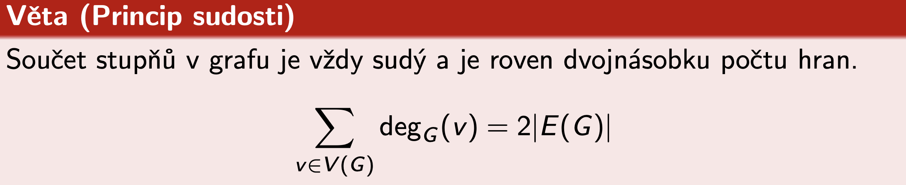

## Věta Havlova-Hakimiho

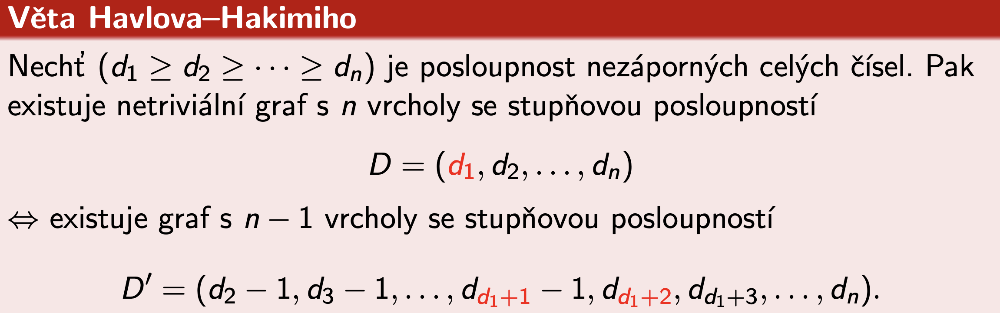

## Indukovaný podgraf

- Vznikne tak, že vezmu vybrané uzly z původního grafu a zachovám jen ty **hrany**, které mezi nimi už v původním grafu **existovaly**
- Žádné nové hrany neměním, jen "zdědím" vztahy mezi těmi vybranými uzly

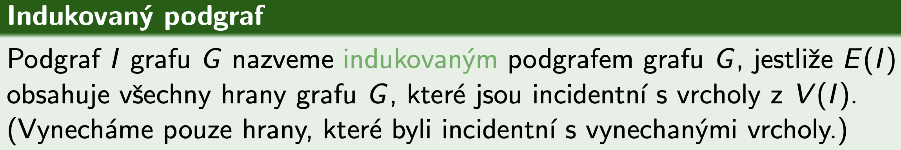

## Isomorfismus grafů

- Grafy, které jsou navzájem **ekvivalentní**, liší se pouze **jiným označením** vrcholů a hran a **jiným způsobem zakreslení**
- **Počty vrcholů** grafů musí být stejné
- **Počty hran** grafů musí být shodné
- **Počty vrcholů daných stupňů** musí být stejné

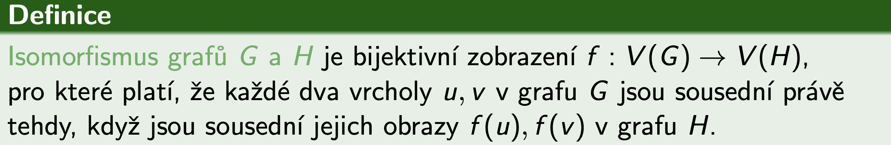

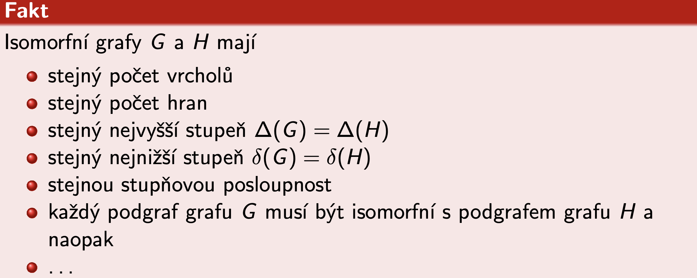

## Sled grafu

- "Procházka" po uzlech, kde jdu z jednoho uzlu do druhého po hranách
- Můžu chodit **dokola**, **vracet se na stejné uzly** a také přecházet stejné hrany vícekrát
- **Vrchol V je dosažitelný z vrcholu U, jestliže v grafu existuje sled z vrcholu U do vrcholu V**
- Souvislý graf musí mít pro každé 2 vrcholy U, V je vrchol V dosažitelný z vrcholu U

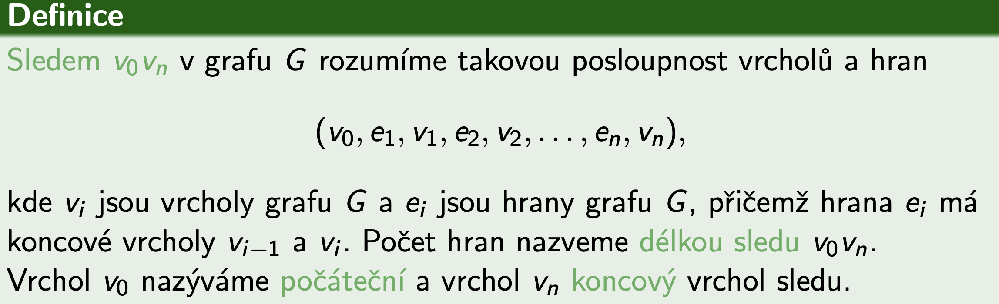

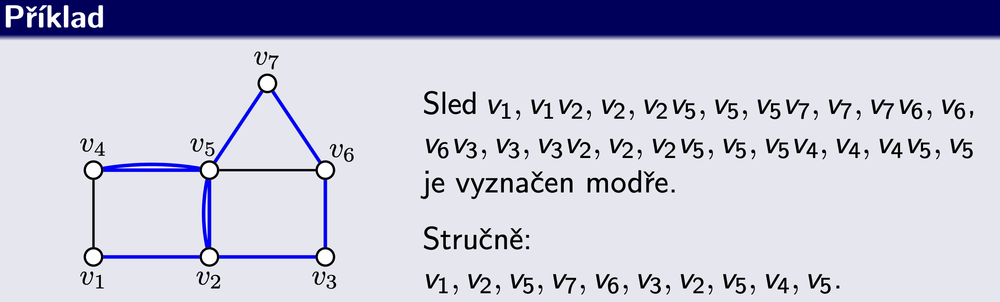

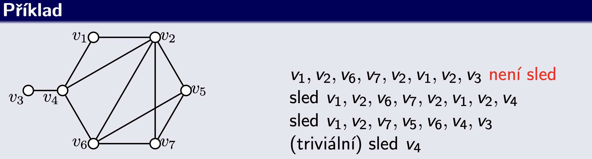

## Tah a cesta grafu

- Tah grafu je sled, ve kterém se **neopakují žádné hrany**
- Cesta je sled, ve kterém se neopakují žádné vrcholy, tedy ani hrany

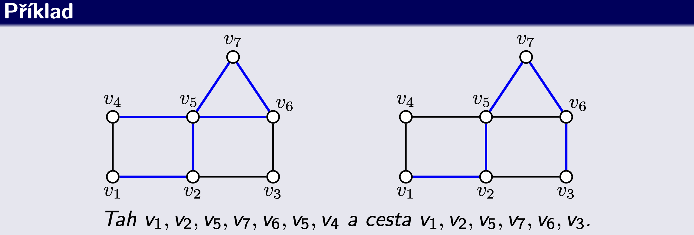

## Komponenta grafu

- Samostatná část grafu, kde jsou všechny uzly propojené, ale na žádné uzly mimo tuto část se nedostanu
- Je to každý maximální souvislý podgraf grafu G

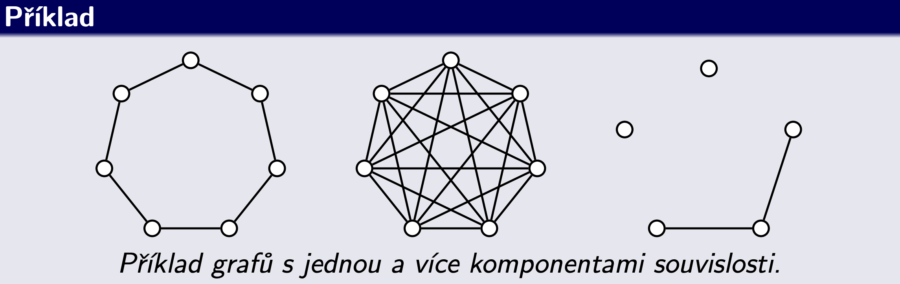

## Vyšší stupně souvislosti

- V praxi nás může zajímat nejen, jestli existuje spojení (cesta) mezi vrcholy, ale také, jestli bude existovat spojení v případě výpadků některých vrcholů

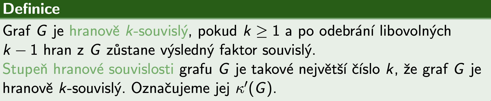

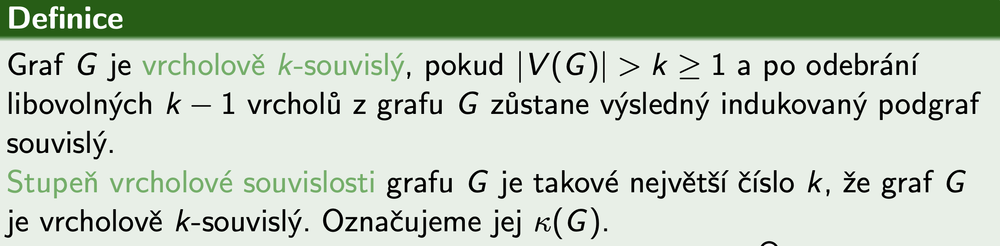

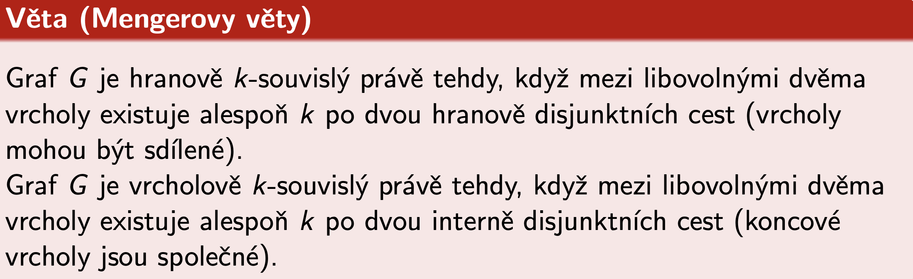

## Eulerovský graf

- Pokud začínám a končím ve stejném vrcholu = **uzavřený eurelovský tah = eulerovský graf**
- Pokud ale končím jinde než jsem začal = **otevřený eulerovský tah**
- Říkáme, že takový graf lze **nakreslit jedním tahem**

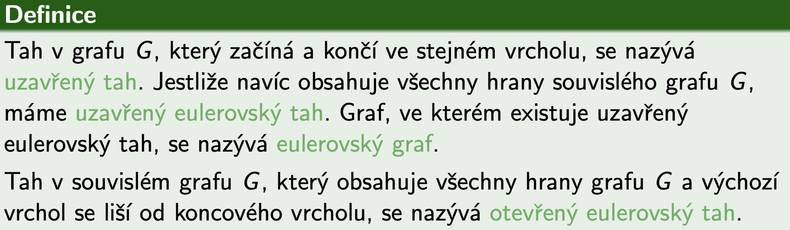

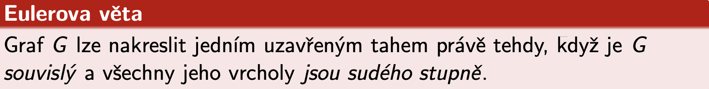

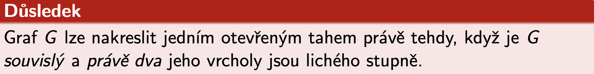

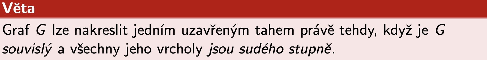

## Hamiltonovský graf

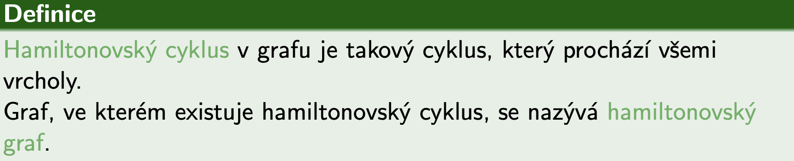

## Vzdálenost grafu

- Pro neohodnocené grafy můžeme předpokládat, že **délka každé hrany je 1**
- Nejkratší sled je vždy **cestou**
- **Ohodocený graf** je ten, která má **každou hranu ohodnocenou**
- **Kladně ohodnocený graf** je ten, který má **všechny ohodnocení kladné**
- **Délka ohodnoceného sledu** je **součet vah** všech jeho hran

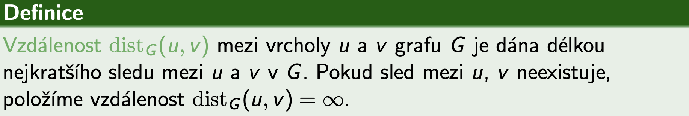

## Dijkstrův algoritmus

- Využívá se pro **hledání nejkratší** (ohodnocené) **cesty** mezi **dvěma vrcholy** váženého (kladně ohodnoceného) grafu
- Najde vzdálenosti z jednoho vrcholu do ostatních (místo mezi všemi dvojicemi vrcholů)
- Reálné využití například pro vyhledávání autobusových spojení
